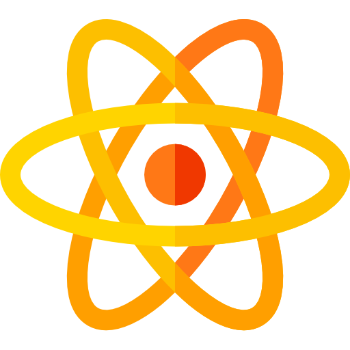

<p align="center"></p>

# Complete Intro to React

## By Rayen Korbi

Welcome to the Complete Intro to React tutorial! This comprehensive course is designed to take you from React beginner to confident developer through hands-on examples and practical lessons.

## What You'll Learn

- React fundamentals and core concepts
- Component-based architecture
- State management and hooks
- Handling forms and user input
- Building interactive UIs
- Working with APIs
- Best practices and optimization techniques

## Getting Started

### Prerequisites

- Basic knowledge of HTML, CSS, and JavaScript
- Node.js installed on your computer
- A code editor (VS Code recommended)

### Installation

1. Clone this repository
   ```
   git clone https://github.com/korbirayen/complete-intro-to-react.git
   ```

2. Navigate to the project directory
   ```
   cd complete-intro-to-react
   ```

3. Install dependencies
   ```
   npm install
   ```

4. Start the development server
   ```
   npm run dev
   ```

5. Open your browser and visit `http://localhost:3000`

## Course Structure

This course is organized into sections, each covering specific React concepts and techniques. Navigate through lessons using the links in the course interface.

## Additional Resources

- [React Official Documentation](https://react.dev)
- [GitHub Repository](https://github.com/korbirayen)

## License

This tutorial is licensed under CC-BY-NC-4.0. Feel free to use this material for learning, but please do not redistribute commercially.

---

© 2025 Rayen Korbi | React Tutorial

